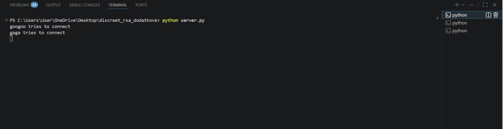
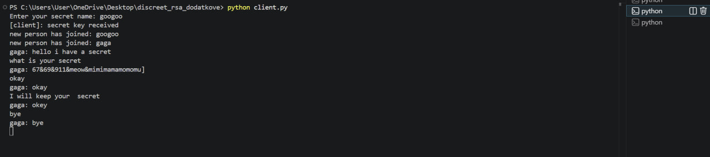
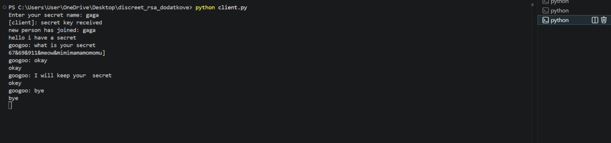

# Discreet_RSA
RSA algorythm for coding messages
У цьому завданні я доробила термінальну чат-програму за допомогою дискретної математики.
Для цього зробилп: RSA-обмін ключами(secret key), шифрування повідомлень і перевірку цілісності повідомлень через SHA-256
RSA, шифрування та перевірка все щроблено для того об ця чат програма була безпечною для використання.
Програма складається з двох файлів:
`server.py`, i `client.py`

# Інструкції до запуску
1. Можете або клонувати репозиторій або створити на свожму комп'ютері папку та перекопіювати код в два так само
названі файли(client.py    server.py)
Якщо ж клонуєте, то виконуйте в новому терміналі по порядку ці команди:
git clone https://github.com/goldilxcks/Discreet_RSA.git
cd <назва_репозиторію>
code .

ПОТРІБНО ЗРОБИТИ 3 НОВІ ТЕРМІНАЛИ!!!!!
2. Запустити сервер
У першому терміналі пишемо:
python server.py
3. Запустити клієнтів
У другому терміналі:

python client.py

Після запуску клієнт попросить ввести ім’я:

Enter your secret name:

У третьому терміналі можна запустити ще одного клієнта і зробити ті самі крокиб що й з першим клієнтом
3. Обмін повідомленнями
Після підключення клієнтів можна вводити повідомлення прямо в терміналі.
Повідомлення одного клієнта буде переслано іншому клієнту через сервер.
# Пояснення імплементації
У цій роботі ми зробили чат більш безпечним. Для цього ми використали RSA для обміну ключами, XOR для шифрування повідомлень і SHA-256 для перевірки цілісності(integrity). Коли клієнт підключається до сервера, він генерує пару ключів — відкритий і закритий. Відкритий ключ відправляється серверу, а сервер сворює випадковий секретний ключ(secret_key).

Потім сервер шифрує цей секретний ключ за допомогою відкритого ключа клієнта і відправляє назад. Клієнт розшифровує його своїм закритим ключем, тому тепер і клієнт, і сервер знають один і той самий секретний ключ.
Після цього всі повідомлення вже шифруються не через RSA, а простішим способом — через XOR(тому що якщо шифрувати через RSA то для повідомлення із 50 символів викличеться 50 разів і це буде не оптиммально по часу). Для цього ми беремо secret_key, перетворюємо його в байти через SHA-256 і використовуємо як ключ. Далі кожен символ повідомлення ^ (типу XOR) з відповідним байтом ключа. Це означає, що ми беремо байт повідомлення і робимо з ним операцію ^ з байтом ключа. Так формується зашифроване повідомлення. При розшифруванні робиться те саме, бо XOR працює в обидві сторони.

Перед тим як відправити повідомлення, ми також рахуємо його хеш за допомогою hashlib.sha256. Це стандартна бібліотека Python, і її використовувати можна за умовою!!! Потім ми відправляємо не просто повідомлення, а пару: хеш і зашифрований текст. На стороні отримувача повідомлення спочатку розшифровується, потім для нього знову рахується хеш і порівнюється з тим, що прийшов. Якщо вони не співпадають, значить повідомлення було змінене по дорозі.
У коді використовуються тільки стандартні бібліотеки Python: socket для підключення по мережі, threading щоб одночасно читати і писати повідомлення, json для передачі даних у зручному форматі, random для генерації чисел (наприклад, простих чисел і секретного ключа) і hashlib для хешування. Використовуються алгоритми з дискретнох математиеи (наприклад, пошук НСД, розширений алгоритм Евкліда(назвається extended_gcd),обернене за mod число, перевірка на простоту). Також використовуються цикли while і for, наприклад для пошуку простих чисел або для проходу по байтах повідомлення під час XOR.
Сервер працює як посередник: він приймає повідомлення від одного клієнта, розшифровує його, перевіряє хеш і потім знову шифрує це повідомлення окремо для кожного іншого клієнта, використовуючи їхні секретні ключі. Це потрібно, бо у кожного клієнта свій ключ. Після цього сервер розсилає повідомлення всім іншим клієнтам.
У результаті ми отримали чат, де повідомлення не передаються відкритим текстом, перевіряється їхня цілісність, і ключ передається безпечно через RSA.
Ось докази запуску:
Сервер:

Клієнти 2:

